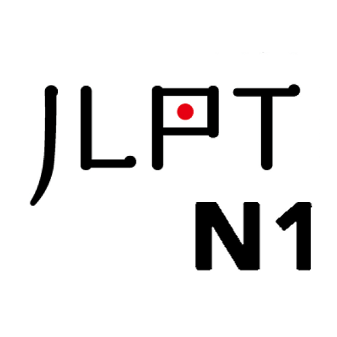

<h1 align="center">Ciallo ～(∠・ω< )⌒★ I'm KazaRimne</h1>
<h3 align="center">An illustrator who codes games with Unity.</h3>
<h3 align="left">My Arts:</h3>

  

<h3 align="left">My web (English version coming soon):</h3>
<a href="https://kazarimne.github.io/kazarimneweb">
  kazarimne.github.io
</a>

<h3 align="left">Languages and Tools:</h3>
<table>
  <tr>
    <td valign="top" width="100%">
      
    </td>
  </tr>
</table>
